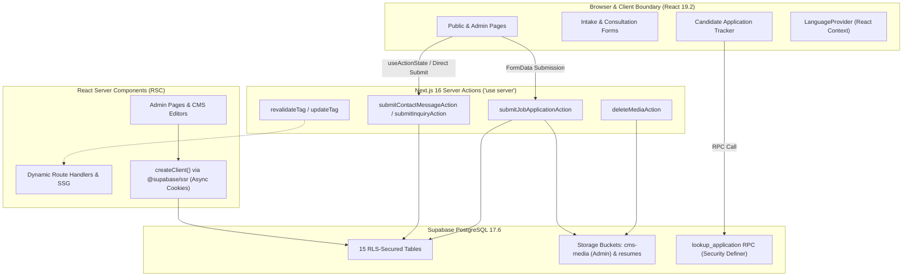

# Implementation Plan: Comprehensive Remediation & Modernization of `nextjs_yessbgd`

**Target Application:** `nextjs_yessbgd` (YESS Bangladesh Sovereign Venture Studio & Conglomerate Platform)  
**Framework Standards:** Next.js 16.3.6 (App Router, Turbopack, `'use cache'` Cache Components) • React 19.2.8 • Tailwind CSS v4  
**Database Infrastructure:** Supabase PostgreSQL 17.6 (Project Ref: `vhffmxoqirbczmcpoqtx`)  
**Based on Audit Report:** [`nextjs_yessbgd_codebase_review_report.md`](file:///home/syed/.gemini/antigravity/brain/d5d5d2a6-790b-4eb6-9545-ca201072dff6/nextjs_yessbgd_codebase_review_report.md)  
**Date:** September 29, 2026  
**Status:** Awaiting User Approval  

---

## 1. Executive Summary & Scope

This implementation plan provides a battle-tested, structured engineering roadmap to remediate all 9 critical finding areas identified during the full codebase and Supabase database audit of `nextjs_yessbgd`. 

### Explicit Exclusion
> [!IMPORTANT]
> **User Exclusion:** As explicitly instructed by the user, **rotating the `admin@yessbgd.com` password in Supabase Auth is excluded from this plan** and will be performed by the user at a later time. All other findings—including cleaning hardcoded passwords from repository scripts and enforcing environment variables—are in scope.

### Core Objectives
1. **Zero Disconnected Forms:** Connect all 4 consultation/briefing forms across `/about/*` corridors to real backend persistence via Supabase.
2. **Eliminate Silent Failures:** Ensure all Server Actions (`applications.ts`, `contact.ts`) return explicit, typed status and error messages rather than masking database errors with false-positive successes.
3. **De-Mock the Application Tracker:** Transition `/application-status` from hardcoded "Syed Reza" mock dossiers to a clean, production-grade lookup state with real calendar invite exports (RFC 5545 `.ics`), genuine resume downloads, and live status progress.
4. **Reconcile Canonical Slugs & Bind Severed Props:** Eliminate discrepancies between database slugs and UI maps across `VenturesDirectory.tsx`, `Header.tsx`, `HomeClient.tsx`, and `industries/[slug]`, ensuring accurate enterprise valuations, metrics, and CMS updates.
5. **App Router RSC Compliance:** Eliminate browser client imports in Next.js 16 Server Components (`/admin/cms/*`, `/admin/pages/*`) to guarantee authenticated session cookies and draft visibility.
6. **Protect React 19 Virtual DOM:** Eliminate dangerous direct DOM `nodeValue` mutation in `AutoTranslator.tsx` in favor of declarative dictionary lookups via `LanguageProvider`.
7. **Production Storage Security & Media Management:** Lock down public upload policies on `cms-media`, fix `resumes` bucket RLS for clean uploads, and implement image deletion in the admin gallery.
8. **Flawless Code Quality:** Resolve all 159 ESLint errors and eliminate explicit `any` types to achieve a clean `npm run lint` and `npm run build`.

---

## 2. Architectural Blueprint & Modern Best Practices



---

## 3. Detailed Work Breakdown & Execution Roadmap

### Phase 1: Security & Storage RLS Remediation

#### 1.1 Lock Down Supabase Storage RLS Policies
- **Problem:** Supabase policy `allow public insert to cms-media` allows unauthenticated public users with the anon key to upload arbitrary files to the `cms-media` bucket. Furthermore, the `resumes` bucket has an `INSERT` policy, but `submitJobApplicationAction` calls `.upload(..., { upsert: true })`, which triggers an `UPDATE` command in Supabase Storage and fails under RLS.
- **Remediation:**
  1. Drop the insecure `allow public insert to cms-media` policy via Supabase SQL:
     ```sql
     DROP POLICY IF EXISTS "allow public insert to cms-media" ON storage.objects;
     ```
  2. Ensure only authenticated administrators can insert, update, and delete in `cms-media`:
     ```sql
     -- Verified: "admin manage cms-media" already grants ALL to authenticated users with has_role(auth.uid(), 'admin')
     ```
  3. Ensure candidate resumes can be cleanly uploaded with unique paths, and grant `UPDATE` to anonymous candidate uploads on `resumes` if upserting is permitted, or enforce unique timestamped paths in the server action:
     ```sql
     CREATE POLICY "anyone update resume" ON storage.objects
       FOR UPDATE TO anon, authenticated
       USING (bucket_id = 'resumes')
       WITH CHECK (bucket_id = 'resumes');
     ```

#### 1.2 Clean Repository Secrets from Automation Scripts
- **Problem:** `scripts/seed-supabase.ts`, `scripts/verify-e2e.ts`, and `scripts/browser-automation-test.ts` contain hardcoded plain-text passwords (`Admin@YessBgd2026!`).
- **Remediation:**
  1. Refactor scripts to strictly require `process.env.ADMIN_PASSWORD`:
     ```typescript
     const ADMIN_PASSWORD = process.env.ADMIN_PASSWORD;
     if (!ADMIN_PASSWORD) {
       console.error("FATAL: ADMIN_PASSWORD environment variable is required to execute this script.");
       process.exit(1);
     }
     ```
  2. Document the environment variable in `.env.example`.
  3. *(Note: Password rotation in Supabase Auth will be handled later by the user as requested).*

---

### Phase 2: Connect Severed Forms & Eliminate Silent Failures

#### 2.1 Unified Consultation Server Action
- **Problem:** 4 briefing forms across `/about/*` corridors (`LeadershipClient.tsx`, `AwardsClient.tsx`, `MethodologyClient.tsx`, `StandardsClient.tsx`) call `e.preventDefault(); setSubmitted(true);` with zero backend persistence.
- **Remediation:**
  1. Enhance `app/actions/contact.ts` to support specialized corporate inquiry submissions via a unified schema:
     ```typescript
     export async function submitInquiryAction(payload: {
       full_name?: string;
       email: string;
       organization?: string;
       practice_area: string;
       message: string;
       metadata?: Record<string, unknown>;
     }): Promise<{ success: boolean; error?: string }>
     ```
  2. Connect all 4 disconnected client forms:
     - **`LeadershipClient.tsx`:** Form maps to `practice_area: "Executive Briefing: Leadership"`, saving the applicant's name, corporate email, organization, focus area, and briefing scope into `contact_messages`.
     - **`AwardsClient.tsx`:** Form maps to `practice_area: "Compliance & Accreditations Pack"`, saving email, organization, and certification scope into `contact_messages`.
     - **`MethodologyClient.tsx`:** Form maps to `practice_area: "Architecture Feasibility Diagnostic"`, saving project name, deployment scale, tech stack, and scope.
     - **`StandardsClient.tsx`:** Form maps to `practice_area: "ESG & Quality Audit Pack"`, saving organization, standards checklist, and email.
  3. Include accessible loading states (`isPending`), success state banners, and inline error feedback.

#### 2.2 Fix Silent Failure Swallowing in Server Actions
- **Problem:** `submitJobApplicationAction` (`app/actions/applications.ts`) and `submitContactMessageAction` (`app/actions/contact.ts`) log console warnings on database insertion failure but return `{ success: true }`, giving users false confidence when data was lost.
- **Remediation:**
  1. In `app/actions/applications.ts`:
     - If `supabase.storage.from("resumes").upload` fails, log the error and decide if application submission should proceed or fail with a clear descriptive message (`"Resume upload failed. Please ensure file is a valid PDF under 10MB."`).
     - If `supabase.from("job_applications").insert` fails, return:
       ```typescript
       if (insertErr) {
         return { success: false, error: `Failed to record application: ${insertErr.message}` };
       }
       ```
     - In the `catch (err)` block, return `{ success: false, error: ... }` rather than inventing a phantom reference code.
  2. In `app/actions/contact.ts`:
     - Return `{ success: false, error: insertErr.message }` when `insertErr` is returned by Supabase.
     - Return `{ success: false, error: errorMessage }` in the `catch` block.
  3. Update calling components (`JobApplicationForm.tsx`, `ContactFormAndLocator.tsx`) to display real error messages from the server action.

---

### Phase 3: Application Status Tracker Overhaul

#### 3.1 Initial Search & Empty State
- **Problem:** Visiting `/application-status` without URL parameters currently defaults to `"YESS-ENG-2026-89412"` and `"syed.candidate@example.com"`, rendering a static fake application dossier for "Syed Reza".
- **Remediation:**
  1. Remove default hardcoded state from `refId` and `candidateEmail`.
  2. If no `ref` or `email` search parameters are provided and no search has been initiated, display a clean, reassuring "Ready to Track" prompt explaining how to locate the Reference ID from the confirmation email or submission receipt.
  3. If a search yields no records from `lookup_application`, render a distinct "Application Dossier Not Found" card with troubleshooting steps (verify email spelling, check reference format `YESS-[DEPT]-[YEAR]-[ID]`).

#### 3.2 Real Interactive Controls & Features
- **Problem:** Buttons for "Download Application PDF", "Add to Google Calendar", and "Reschedule Request" fire dummy `alert(...)` dialogues.
- **Remediation:**
  1. **Calendar Invite Export (RFC 5545 `.ics`):**
     - When an interview is scheduled, generate a genuine `.ics` calendar file client-side using a `Blob` with MIME type `text/calendar;charset=utf-8`:
       ```typescript
       const icsContent = [
         "BEGIN:VCALENDAR",
         "VERSION:2.0",
         "PRODID:-//YESS Bangladesh//Recruitment Portal//EN",
         "BEGIN:VEVENT",
         `SUMMARY:Interview: ${liveApp.opening_title} — YESS Bangladesh`,
         `DESCRIPTION:Interview round with YESS Bangladesh talent committee. Ref: ${liveApp.reference_number}`,
         `LOCATION:Dhaka HQ (Mirpur-11) / Google Meet`,
         `DTSTART:${formatIcsDate(scheduledDate)}`,
         `DTEND:${formatIcsDate(endDate)}`,
         "STATUS:CONFIRMED",
         "END:VEVENT",
         "END:VCALENDAR"
       ].join("\r\n");
       ```
     - Trigger automatic browser download or provide a direct link to Google Calendar (`calendar.google.com/calendar/render?...`).
  2. **Application Dossier / Resume Download:**
     - If the candidate uploaded a resume (`liveApp.resume_url`), retrieve a signed URL via `supabase.storage.from("resumes").createSignedUrl(...)` or direct download so the candidate can inspect their submitted resume.
     - Provide an on-the-fly printable HTML summary of their submission record.
  3. **Reschedule / Talent Inquiry Modal:**
     - Replace the `alert()` call with an interactive modal allowing candidates to submit a message to the recruitment desk.
     - Call `submitContactMessageAction` with `practice_area: "Candidate Inquiry: " + refId`, saving their request directly into `contact_messages`.

---

### Phase 4: Data Binding, Slug Reconciliation & Layout Optimization

#### 4.1 Reconnect Home Page CMS Data (`HomeClient.tsx`)
- **Problem:** `app/page.tsx` fetches `sitePage` and `venturesList` and passes them to `<HomeClient>`, but `HomeClient` prefixes them as `_sitePage` and `_initialVentures` and ignores them, hardcoding all 6 hero/brand cards. CMS page updates have zero impact on the home page.
- **Remediation:**
  1. Update `HomeClientProps` with explicit types (`CmsSitePage`, `Venture[]`).
  2. Bind `sitePage.hero_eyebrow`, `sitePage.hero_title`, and `sitePage.hero_subtitle` as priority display text (falling back gracefully to defaults).
  3. Bind `initialVentures` to the Brands grid, rendering live ventures dynamically while maintaining the polished, interactive card designs.
  4. Prune or integrate the orphaned component `components/home/HomeVenturesFilter.tsx`.

#### 4.2 Reconcile Canonical Slugs in `VenturesDirectory.tsx`
- **Problem:** `components/VenturesDirectory.tsx` maps valuations, icons, and metrics against made-up slugs (`yess-technology`, `akash-news`, `yess-organic-food`, `yess-one-stop-engineering`, etc.) that do not match the database `cms_ventures` or `data/ventures.ts` (`yess-host`, `the-daily-akash`, `yess-organic-haat`, `yess-all-in-one-solution`, etc.). As a result, valuations evaluate to 0 and metrics are empty.
- **Remediation:**
  1. Update `VENTURE_ICONS`, `ventureMetrics`, and `VENTURE_VALUATIONS` in `components/VenturesDirectory.tsx` to use the 13 canonical database slugs:
     - `yess-service` (Shondhaan)
     - `akash-tv` (Akash TV)
     - `akash-ott` (Akash OTT)
     - `the-daily-akash` (The Daily Akash)
     - `yess-host` (Yess Host)
     - `yess-soft` (Yess Soft)
     - `yess-legal-advice` (Yess Legal Advice)
     - `yess-organic-haat` (Organic Haat)
     - `yess-event` (Yess Event)
     - `yess-model` (Yess Model)
     - `yess-food` (Yess Food)
     - `yess-tourism` (Yess Tourism)
     - `yess-all-in-one-solution` (All-in-One Solution)
  2. Verify that total enterprise valuation correctly aggregates to the intended \$50M+ portfolio figure.

#### 4.3 Reconcile Industry Hero Background Slugs
- **Problem:** `industryBgMap` in `app/industries/[slug]/page.tsx` maps against outdated slugs (`manufacturing-rmg`, `ecommerce-retail`, `financial-services`, `healthcare-pharma`).
- **Remediation:**
  - Update `industryBgMap` to match the canonical 8 slugs from `cms_industries`:
    - `media-broadcasting`
    - `retail-ecommerce`
    - `education`
    - `healthcare`
    - `banking-finance`
    - `manufacturing`
    - `logistics-supply-chain`
    - `government-ngo`

#### 4.4 Header Dynamic Ventures
- **Problem:** `Header.tsx` receives `ventures: _ventures` from `layout.tsx` but hardcodes `FEATURED_VENTURES` and contains an outdated slug (`akash-news` instead of `the-daily-akash`).
- **Remediation:**
  - Wire the `ventures` prop to dynamically supplement or populate the header navigation dropdown.
  - Fix any mismatched links to point to valid canonical routes.

---

### Phase 5: App Router RSC Supabase Client Bug Fix & Cache Purging

#### 5.1 Fix Supabase Client in Server Components
- **Problem:** `app/admin/pages/[page]/page.tsx`, `app/admin/cms/[type]/page.tsx`, and `app/admin/cms/[type]/[id]/page.tsx` import `@/lib/supabase/client` (the browser client). In Server Components, the browser client lacks access to request cookies, treating the admin as anonymous (`auth.uid() = null`). RLS policies (`is_published = true`) consequently prevent admins from seeing draft pages or draft CMS entities.
- **Remediation:**
  1. Replace `import { supabase } from "@/lib/supabase/client";` with:
     ```typescript
     import { createClient } from "@/lib/supabase/server";
     // ...
     const supabase = await createClient();
     ```
  2. Await `params` in accordance with Next.js 16 requirements (already in place).
  3. Verify that draft items (`is_published = false`) and unpublished pages load seamlessly in the admin editor.

#### 5.2 Next.js 16 Cache Purge Directives
- **Problem:** In `app/admin/actions.ts`, `purgeTag` uses `(revalidateTag as any)(tag)`.
- **Remediation:**
  - Use Next.js 16 typed `revalidateTag(tag)` and `updateTag(tag)` for instant read-your-own-writes consistency.

---

### Phase 6: Internationalization Architecture (Protect React 19 Virtual DOM)

#### 6.1 Eliminate Dangerous DOM `nodeValue` TreeWalker Mutation
- **Problem:** `components/AutoTranslator.tsx` uses a browser `TreeWalker` to traverse `#main-content` and directly overwrite `node.nodeValue`. Mutating DOM text nodes outside of React breaks React 19's virtual DOM reconciliation and hydration, risking browser crashes or silent text resets on re-render.
- **Remediation:**
  1. Migrate all remaining translation phrases from `TRANSLATION_MAP` into `dictionaries/en.json` and `dictionaries/bn.json`.
  2. Leverage `LanguageProvider`'s `useLanguage().t(key, fallback)` hook for all UI text across components.
  3. Replace `AutoTranslator`'s direct DOM mutation with a safe declarative mechanism or retire the TreeWalker entirely, ensuring React 19 controls 100% of the DOM nodes.

---

### Phase 7: Administrative Console Polish & Media Deletion

#### 7.1 Implement Media Deletion
- **Problem:** The Media Gallery (`app/admin/media/page.tsx`) imports `Trash2` but lacks a delete button or backend deletion action.
- **Remediation:**
  1. Implement `deleteMediaAction(id: string, filePath: string)` in `app/admin/actions.ts`:
     - Delete file from Supabase Storage `cms-media`.
     - Delete record from `cms_media` table.
     - Log deletion in `audit_logs`.
  2. Add a trash/delete confirmation button to each media card in `app/admin/media/page.tsx`.

#### 7.2 Synchronize ATS Pipeline Status Casing
- **Problem:** `app/admin/applications/page.tsx` filter tabs expect capitalized strings (`"Submitted"`, `"Under review"`), while `app/actions/applications.ts` submits lowercase `"submitted"`. The exact match filter (`a.status === statusFilter`) fails, hiding all submitted applications under the filter.
- **Remediation:**
  1. Standardize candidate status values to canonical lowercase strings across the entire stack:
     `submitted`, `screening`, `interview`, `offered`, `hired`, `rejected`.
  2. Make filter matching case-insensitive (`a.status?.toLowerCase() === statusFilter.toLowerCase()`).
  3. Ensure status progression actions in the admin UI use matching canonical strings.

---

### Phase 8: Strict Typing & Lint Cleansing

#### 8.1 Resolve All 159 ESLint Errors
- **Problem:** `npm run lint` fails with 339 problems (159 errors, 180 warnings), primarily due to `@typescript-eslint/no-explicit-any` and unused variables.
- **Remediation:**
  1. Define explicit TypeScript interfaces for all CMS entities in `types/cms.ts` or `lib/cms.ts` (e.g., `CmsSitePage`, `CmsVenture`, `CmsService`, `CmsIndustry`, `CmsOpening`).
  2. Remove explicit `any` casts from `lib/cms.ts`, `app/HomeClient.tsx`, `components/NewsletterSubscription.tsx`, and `lib/supabase/server.ts`.
  3. Remove all unused imports and variables across admin components (`AdminShell.tsx`, `PageEditorClient.tsx`, `EntityEditorClient.tsx`).
  4. Ensure `npm run lint` completes with **0 errors**.

---

## 4. Verification & Testing Plan

### Automated Verification Steps
1. **Lint Verification:**
   ```bash
   npm run lint
   ```
   *Success criteria:* 0 errors.
2. **Build Verification (Turbopack + PPR + Cache Components):**
   ```bash
   npm run build
   ```
   *Success criteria:* Clean compilation with all 36 routes prerendered / dynamic as intended.
3. **End-to-End Functional Test Suite:**
   - Execute an updated verification script testing:
     - Form submissions for all 4 `/about/*` corridors (`contact_messages` records created).
     - Job application submission with resume upload (`job_applications` and `resumes` storage object created).
     - `/application-status` lookup with newly submitted application reference ID.
     - Calendar `.ics` download validity.
     - Admin draft page visibility via authenticated server client.
     - Media upload and delete cycle.

---

## 5. User Decision & Approval Gate

> [!NOTE]
> Please review this implementation plan. If you are satisfied with the proposed architecture, phasing, and remediation steps, click **Proceed** or approve the plan to begin execution.
