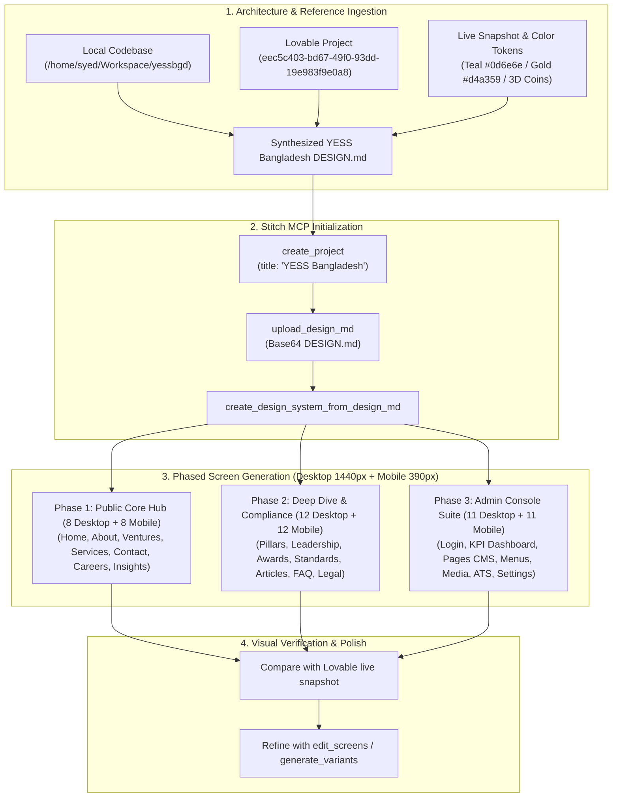

# Implementation Plan: Exact Carbon-Copy Page-by-Page Design Generation via Stitch MCP

## Goal Description
Recreate an exact carbon copy of the **YESS Bangladesh** digital ecosystem (public portal + executive admin console) inside the **Stitch MCP** server. The design generation references both the local codebase (`/home/syed/Workspace/yessbgd`) and the live Lovable project ([Lovable Reference: eec5c403-bd67-49f0-93dd-19e983f9e0a8](https://lovable.dev/projects/eec5c403-bd67-49f0-93dd-19e983f9e0a8), [Preview URL](https://id-preview--eec5c403-bd67-49f0-93dd-19e983f9e0a8.lovable.app)).

Every core screen will be generated in **dual viewports**:
- **Desktop Viewport:** 1440px wide layout with mega-menu dropdowns, multi-column grids, and floating social rails.
- **Mobile Viewport:** 390px wide layout with collapsible accordion drawers, single-column reflow, and docked bottom navigation tab bar.

---

## User Review & Decisions Confirmed

> [!NOTE]
> **Resolved Configuration Choices:**
> 1. **Project Title:** Confirmed as `"YESS Bangladesh"`.
> 2. **Viewports:** Confirmed for **both Desktop (1440px)** and paired **Mobile (390px)** screen instances for all core pages.
> 3. **Execution Cadence:** Phased generation starting with **Phase 1: Public Core Hub** to verify visual styling and tokens before proceeding to Phase 2 and Phase 3.

---

## Proposed Execution Strategy

### Step 1: Stitch Project & Design System Provisioning
1. **Create Project:** Call `create_project` on Stitch MCP with `title: "YESS Bangladesh"`.
2. **Encode & Upload `DESIGN.md`:** Convert the codified YESS Bangladesh design tokens (Teal `#0d6e6e`, Gold `#d4a359`, Liquid Glass, 3D Minted Medallions, Plus Jakarta Sans / Inter typography) into Base64 and upload via `upload_design_md`.
3. **Compile Design System:** Call `create_design_system_from_design_md` to establish the official theme for all subsequent screen generations.

---

### Step 2: Screen Generation Pipeline (Desktop 1440px & Mobile 390px)

#### Phase 1: Public Core Pages (8 Templates = 16 Screens)
Each template is generated twice: once with `deviceType: "DESKTOP"` and once with `deviceType: "MOBILE"`.

1. **Homepage (`/`):**
   - *Desktop:* Top utility bar, sticky glass navbar, cinematic hero with Dhaka photo backdrop, 4 minted 3D coin disks (Yess Soft, Shondhaan, Yess Organic Haat, Akash OTT), bilingual profile download cards, client marquee, services grid, metrics counter, venture showcase, and mega footer.
   - *Mobile:* Hamburger menu, stacked hero with swipeable coin disk carousel, stacked service cards, compact 2x2 counter grid, and docked bottom tab bar (`MobileTabBar`).
2. **About Overview (`/about`):**
   - *Desktop:* Hero, 5 strategic pillars grid, alternating vertical milestone timeline (2018–2026), governance statement.
   - *Mobile:* Single-column pillar list, simplified chronological milestone stepper.
3. **Ventures Directory (`/ventures`):**
   - *Desktop:* Sticky horizontal sector filter bar (All, Tech, Energy, Agro, Logistics, Healthcare), search input, 3-column card grid for 13 ventures.
   - *Mobile:* Horizontal scrollable pill chips, full-width venture cards with quick-callout metrics.
4. **Single Venture Profile (`/ventures/:slug`):**
   - *Desktop:* Venture header with logo, products & services grid, technology badge cloud, milestone timeline, downloadable PDF factsheet, sticky inquiry sidebar.
   - *Mobile:* Collapsible tabbed views (Overview, Products, Milestones) and sticky 'Inquire Now' bottom CTA button.
5. **Services Overview (`/services`):**
   - *Desktop:* 6 enterprise capability cards, 3-tier engagement model comparison matrix (Advisory, Product Pods, Turnkey EPC), pricing and SLAs.
   - *Mobile:* Vertically stacked service cards, swipeable engagement tiers comparison table.
6. **Careers Hub & Application Wizard (`/careers`):**
   - *Desktop:* Life at YESS culture mosaic, benefits grid, filterable jobs table, multi-step application modal with resume upload.
   - *Mobile:* Benefits list, collapsible job cards with 1-click 'Apply' modal optimized for mobile touch targets.
7. **Contact & Office Locator (`/contact`):**
   - *Desktop:* Enterprise inquiry form on the left, interactive dual-office selector (Corporate HQ vs Mirpur-12 Innovation Lab) with embedded map view on the right.
   - *Mobile:* Office tab toggle above full-width interactive map, followed by clean mobile inquiry form and direct WhatsApp hotline button.
8. **Insights Hub (`/insights`):**
   - *Desktop:* Featured editorial split-card hero, category filter pills, 3-column article cards, newsletter banner.
   - *Mobile:* Stacked featured article, horizontal scroll category pills, single-column article cards with thumbnail and reading time.

---

#### Phase 2: Public Deep Dive & Governance (12 Templates = 24 Screens)
9. **About Pillar Detail (`/about/:pillar`):** Pillar mission manifesto, SDG alignment badges, ESG report card (Desktop & Mobile).
10. **Leadership & Board (`/about/leadership`):** Chairman & MD keynote message with signature, executive board cards, advisory council (Desktop & Mobile).
11. **Awards & Accolades (`/about/awards`):** Trophy showcase, awarding bodies (BASIS, Asia CEO Summit), certificate preview modals (Desktop & Mobile).
12. **Methodology & Framework (`/about/methodology`):** 4-step delivery pipeline (Discover, Design, Build, Scale), sprint gates diagram (Desktop & Mobile).
13. **Standards & QA (`/about/standards`):** ISO 9001 and ISO 27001 badges, compliance checklists (Desktop & Mobile).
14. **Service Detail (`/services/:slug`):** Deliverables checklist, before/after ROI case study, consultation booking widget (Desktop & Mobile).
15. **Industries Overview (`/industries`):** 8 target industrial sectors index (RMG, FinTech, Agriculture, Energy, etc.) (Desktop & Mobile).
16. **Industry Detail (`/industries/:slug`):** Sector case study, IoT automation diagram, client quotation (Desktop & Mobile).
17. **Insight Article (`/insights/:slug`):** Long-form editorial article layout, reading progress indicator, social share rail, table of contents (Desktop & Mobile).
18. **Application Status Tracker (`/application-status`):** Reference ID lookup, 5-stage candidate progress stepper (Desktop & Mobile).
19. **FAQ (`/faq`):** Search bar with expandable accordion rows grouped by topic (Desktop & Mobile).
20. **Legal & CMS Dynamic Page (`/terms`, `/privacy`, `/p/:slug`):** Clean institutional document template with version history and sticky clause navigator (Desktop & Mobile).

---

#### Phase 3: Admin Console Suite (`.admin-scope` - 11 Templates = 22 Screens)
21. **Admin Login (`/admin/login`):** Slate-indigo card, email/password inputs, rate-limit security notice (Desktop & Mobile).
22. **Executive KPI Dashboard (`/admin`):** Sidebar navigation, 4 summary metric tiles, inbound leads table, activity audit log feed (Desktop & Mobile).
23. **Site Pages Manager (`/admin/pages`):** 20-page directory table, publishing status, bilingual EN/BN tabbed block editor (Desktop & Mobile).
24. **Dynamic CMS & Entity Manager (`/admin/cms`):** Ventures/services/case studies directory and slide-over drawer editor (Desktop & Mobile).
25. **Navigation Tree Customizer (`/admin/menus`):** Draggable hierarchical tree for header mega-menu and footer links (Desktop & Mobile).
26. **Media Gallery (`/admin/media`):** Asset browser, folder taxonomy, storage quota tracker, file detail inspector (Desktop & Mobile).
27. **Job Applicant ATS (`/admin/applications`):** Candidate table, status badges, resume PDF previewer, scoring & notes panel (Desktop & Mobile).
28. **Inbound Messages & Leads Inbox (`/admin/messages`):** Split-view email client interface with quick reply composer (Desktop & Mobile).
29. **Site Settings & Branding (`/admin/settings`):** Logo uploaders (`BrandingLogoCard`), Google Maps coordinates, company registrations (Desktop & Mobile).
30. **Database Backup & Export (`/admin/data`):** Full snapshot generator, CSV/JSON collection export, restore modal (Desktop & Mobile).
31. **Audit Trail & Activity Log (`/admin/audit`):** Immutable log table with side-by-side JSON diff viewer (Desktop & Mobile).

---

## Verification Plan

### Automated Verification via Stitch & Lovable MCPs
1. **Stitch Project Verification:**
   - Execute `get_project` on the created Stitch project ID to verify project title `"YESS Bangladesh"`, design system binding, and theme status.
2. **Screen Render Verification:**
   - Inspect the returned `thumbnailScreenshot` and `downloadUrl` for every generated screen.
   - Cross-check generated layout blocks against the live Lovable reference snapshot (`media_0.png`) and local route components.
3. **Viewport Integrity Check:**
   - Verify that each template has both a `DESKTOP` instance (1440px wide) and a `MOBILE` instance (390px wide) registered in `list_screens`.

### Manual Verification
1. User reviews the generated Stitch project canvas via the provided download URLs and preview links.
2. Confirm color fidelity: Teal (`#0d6e6e`), Gold (`#d4a359`), and Liquid Glass blur consistency.
3. Confirm component accuracy: Flagship 3D minted coins, language switcher, bilingual download cards, and admin dashboard widgets.
